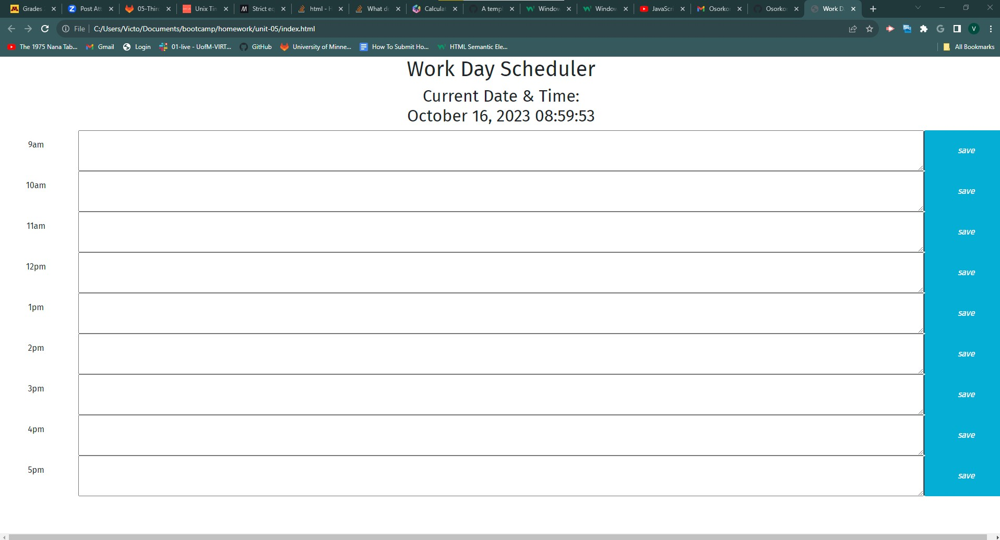

## Daily Planner 
This homework consists of work done with creating the rows of the daily work hour dynamically in Javascript. The continuious time clock should sync with the colors displaying current, past, and future time. Adding items into the text area and hitting the save should store the information into the local storage. Attatched is a screeshot of the page . Links to the Github repo https://github.com/VictorMontelongo/Work-Day-Scheduler and the homepage as well https://victormontelongo.github.io/Work-Day-Scheduler/